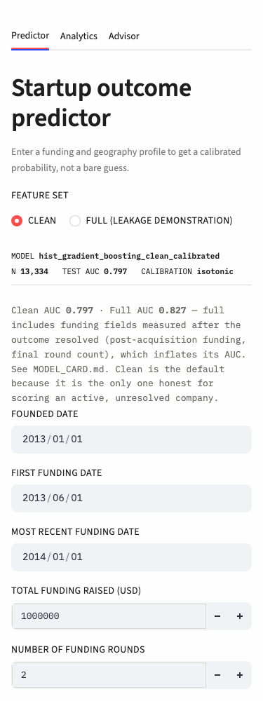
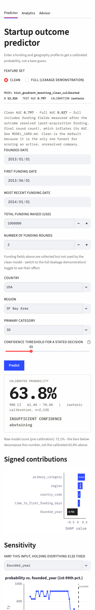
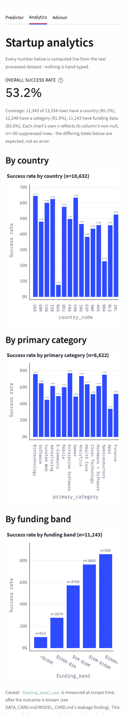
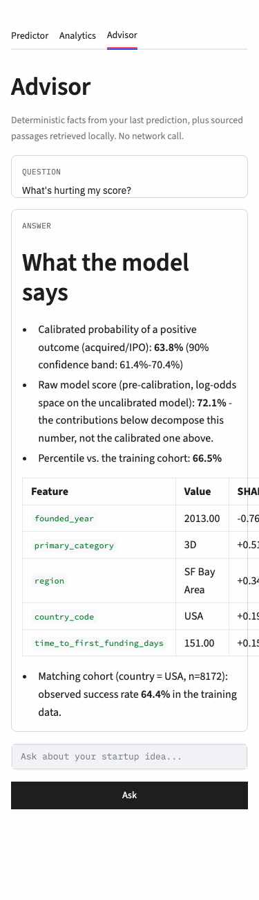

# 🚀 AI-Powered Startup Success Predictor & Advisor

*Data-driven insights and Generative AI to evaluate, predict, and scale the next big unicorn.*

[](https://startup-success-predictor-d5u63hesntzh5ayhsm64ds.streamlit.app/) 
[](#)
[](#)

---

##  The Problem Statement
Over **90% of startups fail** within their first few years. Founders often lack data-backed validation for their ideas and struggle to find actionable, contextual advice during critical phases like fundraising and MVP building. 

**The Solution:** This project bridges the gap between raw statistical data and strategic execution. It provides founders with a realistic success probability based on historical metrics and pairs it with an intelligent AI consultant to guide their next steps.

## 🌟 Key Features

1. **📈 Real-Time Predictive Engine**: 
   - Evaluates startups using a `HistGradientBoostingClassifier` trained on ~13k real, labeled Crunchbase companies (see `DATA_CARD.md`, `MODEL_CARD.md`).
   - Considers funding trajectory (amount, rounds, timing), founding date, country, region, and category.
   - Displays a **calibrated** probability, a real empirical percentile against the training cohort, and SHAP-based reasons for the prediction.
2. **🤖 Fully Local AI Advisor**: 
   - No external LLM API, no API key, no network call at inference time - a deterministic facts core (your prediction's calibrated probability, confidence band, SHAP contributions, percentile, and matching-cohort success rate) plus local TF-IDF retrieval over a small, honestly-sourced corpus.
   - See "🧭 AI Advisor: Local Facts + Retrieval" below and `RETRIEVAL_EVAL.md` for measured recall@k.
3. **📊 Interactive Analytics Dashboard**: 
   - Plotly-powered visual insights into market trends, funding vs. success correlations, and industry risk analysis.
4. **⚡ Headless API Architecture**: 
   - Includes a standalone FastAPI backend, allowing the prediction model to be consumed programmatically by mobile apps or other web services.

## 💎 What Makes This Project Unique?
Unlike standard ML projects that stop at a binary "Pass/Fail" prediction, this application combines **Predictive AI** (Scikit-Learn) with a **fully local, offline-capable Advisor**. It doesn't just tell founders *if* they will succeed—it tells them *why* (real SHAP contributions), *how confident* that estimate is (a measured confidence band), and grounds any further discussion in sourced, cited material rather than an LLM's unconstrained output. It is built with a product-first mindset, featuring custom UI/UX and honest, measured error handling rather than hidden failure modes.

## ⚙️ How It Works (System Flow)
1. **Data Ingestion:** User inputs core startup metrics via the Streamlit UI or REST API.
2. **ML Inference:** The system loads a pre-trained, calibrated `HistGradientBoostingClassifier` (`models/production/hist_gradient_boosting_full_calibrated.joblib`) to calculate a calibrated success probability, a SHAP-based explanation, and a real percentile.
3. **Local Advisor Consultation:** Users ask the AI Advisor questions; it answers with a deterministic facts bundle (grounded in the user's own prediction) plus retrieved, sourced passages from a small local corpus - no network call, no LLM.
4. **Visualization:** The analytics engine processes the real dataset and generates live performance graphs and cohort comparisons.

## Design system

A technical-instrument aesthetic - loosely inspired by typesafe.ai's thesis that a decision is only as good as its stated confidence, not copied from its visuals, copy, or layout. Near-white background (`#FEFEFE`) and near-black text (`#1E1E1E`), zero border radius, 1px hairline borders instead of shadows, IBM Plex Sans for headings/prose and IBM Plex Mono for every number and data label (the numbers are the product), and a single saturated accent (`#2E4BFF`) reserved for stated decisions - insufficient-confidence abstentions render in muted gray instead, never dressed up as an answer. No emoji anywhere in the app itself. Defined once in `theme.py`, shared by `app.py` and `analytics.py` (including Plotly chart theming) so the whole app reads as one instrument, not three separately-styled pages.

## 🛠️ Tech Stack & Architecture

- **Frontend:** Streamlit, Custom HTML/CSS, Plotly
- **Backend & API:** FastAPI, Uvicorn, Python
- **Machine Learning:** Scikit-Learn, Pandas, NumPy, Joblib, SHAP
- **Local Advisor:** TF-IDF retrieval (scikit-learn) - no external LLM, no network dependency

## 🧠 Model Details & Performance
- **Algorithm:** `HistGradientBoostingClassifier`, trained on real Crunchbase data (`DATA_CARD.md`) with a time-based train/test split.
- **Input Features:** `founded_year`, `time_to_first_funding_days`, `funding_total_usd_log1p`, `funding_rounds`, `funding_span_days`, `country_code`, `region`, `primary_category`.
- **Current limitations:** never trained on unresolved (`operating`) companies, inherits Crunchbase's survivorship bias, and the full feature set includes funding fields only known after a company's outcome — see `MODEL_CARD.md`'s "what this model cannot do," and the "⚠️ Limitations" section below.

**Measured metrics (baseline comparison, real numbers, see `MODEL_CARD.md` for full discussion):**

| Model | Feature set | CV ROC-AUC (mean±std, 5×10 repeats) | Test ROC-AUC | Test PR-AUC | Test Brier | Threshold | Test confusion (tn / fp / fn / tp) | Test F0.5 |
|---|---|---|---|---|---|---|---|---|
| dummy_most_frequent | — | 0.5000 ± 0.0000 | 0.5000 | 0.2671 | 0.7329 | 0.01 | 0 / 1951 / 0 / 711 | 0.3130 |
| logistic_regression_full | full | 0.7777 ± 0.0094 | **0.8496** | 0.6522 | 0.1356 | 0.63 | 1881 / 70 / 503 / 208 | 0.5705 |
| logistic_regression_clean | clean | 0.7272 ± 0.0093 | 0.8022 | 0.5463 | 0.1542 | 0.60 | 1854 / 97 / 547 / 164 | 0.4672 |
| hist_gradient_boosting_full | full | 0.7880 ± 0.0094 | 0.8339 | 0.6564 | 0.1444 | 0.65 | 1865 / 86 / 464 / 247 | 0.6045 |
| hist_gradient_boosting_clean | clean | 0.7363 ± 0.0096 | 0.7983 | 0.5476 | 0.1635 | 0.63 | 1844 / 107 / 550 / 161 | 0.4515 |

(n_train = 10,672, n_test = 2,662. Clean-vs-full AUC gap: logistic regression 0.0474, HistGradientBoosting 0.0356 - the leakage finding from `DATA_CARD.md`, corroborated by independent published research, see `data/corpus/model_limitations_leakage_calibration.md`.)

## 🎯 Calibration & Explainability

A `HistGradientBoostingClassifier`'s raw `predict_proba` isn't automatically a calibrated probability — a displayed "73%" should mean "roughly 73 of 100 startups scoring this way actually succeeded," not just "this one ranked highly." `src/models/calibrate.py` fits a fresh base model on a `train_fit` split, then fits `CalibratedClassifierCV` (method chosen automatically: **isotonic**, since the held-out calibration split had 2,135 rows) on a disjoint `calibration` split that neither the base model nor the test cohort ever saw, and evaluates both the raw and calibrated model once on the untouched test cohort.

| | Brier score (test cohort, lower is better) |
|---|---|
| Before calibration | **0.1433** |
| After calibration | **0.1500** |


**Honest finding:** calibration did not improve, and slightly worsened, the Brier score here. `HistGradientBoostingClassifier` is trained with log-loss and tends to already be reasonably calibrated out of the box; fitting an unconstrained isotonic step function on a ~2k-row calibration split can add variance without a clear net benefit. Both reliability diagrams are shown above rather than only the flattering one.

The app's "Why this result?" section is powered by a cached `shap.TreeExplainer` (`src/models/explain.py`) over the base (pre-calibration) tree model, showing the top signed feature contributions for that specific prediction. The "Industry Comparison" percentile is a real empirical percentile (`src/models/percentile.py`) against the calibrated score distribution of the training cohort — not the raw probability relabeled, which is what the app showed before this change.

## 🧭 AI Advisor: Local Facts + Retrieval

The AI Advisor used to forward the raw question straight to Gemini with zero grounding - it knew nothing about the model, the data, or the user's own prediction, had a hardcoded `fallback_response()` that returned "Work on product-market fit." for anything unmatched, and leaked raw exception text (`f"⚠️ Gemini AI Error: {e}"`) into the chat on failure. It's now two fully local layers - **no external LLM API, no API key, no network call at inference time**, verified by the complete absence of any networking import (`requests`, `google.genai`, `urllib`, `socket`) anywhere in `src/advisor/` or `advisor_ai.py`.

**Layer 1 - deterministic facts core** (`src/advisor/facts.py`): given a prediction already made in the Predictor tab, assembles the user's inputs, the calibrated probability and a 90%-confidence Wilson-interval band (looked up from `models/production/confidence_bands.json`, computed once from the real test-cohort reliability data - `src/models/confidence.py`), the top-5 signed SHAP contributions, the training-cohort ECDF percentile, and the observed success rate of the matching cohort (same country, primary category, funding band) in the real dataset - suppressed when n < 30. Every number is either already-computed upstream or a real lookup against committed data; nothing here is invented, and it's independently unit-tested (`tests/test_facts.py`, `tests/test_confidence.py`).

**Layer 2 - local semantic retrieval** (`src/advisor/chunking.py`, `src/advisor/retrieval.py`): six honestly-sourced markdown documents under `data/corpus/` (each cites a real, verified URL in its frontmatter - CB Insights, Startups.com, Wikipedia, a July 2026 peer-reviewed paper independently corroborating this project's own leakage finding, a Springer paper on investor-reputation signals, and scikit-learn's own calibration docs), chunked on a documented strategy (heading-respecting, ~200-word target, 30-word overlap), retrieved via TF-IDF cosine similarity, and reranked with MMR (λ=0.6) for cross-document diversity.

**Memory-budget decision, measured not guessed:** this session installed `fastembed` + `BAAI/bge-small-en-v1.5` and measured its real resident memory: **~367 MB** alone. The rest of this app's own footprint (streamlit+pandas+sklearn+shap+the loaded calibrated pipeline+the committed dataset) measured independently at **~321 MB**. Streamlit Community Cloud throttles starting near **690 MB**. Combined, that's at or over the throttle line before accounting for the retrieval index itself or any headroom - so this project uses **TF-IDF + scikit-learn cosine similarity** instead: zero new dependencies, no ONNX weights to bundle for offline operation, and at a 21-chunk corpus the retrieval-quality gap isn't worth ~370 MB of budget. The built index itself is tiny: ~150 KB on disk (`models/production/advisor_index/`).

**Measured retrieval quality:** recall@3 and recall@5 against a 20-question hand-written eval set are in `RETRIEVAL_EVAL.md` - including two real bugs found and fixed during manual testing (a stemming gap that scored *every* chunk 0.0000 for the canonical "why do startups fail?" query, and a stopword-filtering inconsistency), plus an honest diagnosis of the one persistent miss, not just a headline number.

**The generation seam:** `src/advisor/response.py::generate_response(facts_bundle, retrieved_chunks, question)` is a documented, deliberately unimplemented function signature - exactly the boundary where an opt-in LLM call could later turn the grounded facts + passages into flowing prose, without touching any retrieval or facts-assembly logic. It raises `NotImplementedError` and is never called from the response path.

## 📸 Demo

Real screenshots at 375px width (mobile), captured from the running app via headless Chromium - not mockups.

**Predictor** - inputs, then a calibrated probability with its confidence band and a stated decision (or an honest "insufficient confidence" abstention below the threshold you set), signed SHAP contributions, and a sensitivity chart:

  

**Analytics** - every number computed live from the real dataset, sample sizes in every chart title:



**Advisor** - a deterministic facts bundle grounded in the prediction above, plus sourced passages retrieved locally (no network call):



> **[Live Streamlit App: Startup Success Predictor](https://startup-success-predictor-d5u63hesntzh5ayhsm64ds.streamlit.app/)**

## ⚙️ Installation & Setup

### 1. Clone the repository
```bash
git clone https://github.com/Avnish1505/startup-success-predictor.git
cd startup-success-predictor
```

### 2. Install Dependencies
It is recommended to use a virtual environment.
```bash
pip install -r requirements.txt          # production runtime only
pip install -r requirements-dev.txt      # + testing/linting/training/notebook tools
```

### 3. No API keys needed
The AI Advisor was previously Gemini-backed and needed a `GEMINI_API_KEY` in `.streamlit/secrets.toml`. It's now a fully local facts + retrieval system (see "🧭 AI Advisor: Local Facts + Retrieval" below) - no external API, no key, no network call at inference time.

### 4. Build the data and model pipeline
Requires a Kaggle account and API credentials (`~/.kaggle/kaggle.json` or `KAGGLE_USERNAME`/`KAGGLE_KEY`) for the first step only - `models/production/` is already committed, so this step is only needed if you want to rebuild the pipeline from scratch:
```bash
python -m src.data.build          # downloads the real Crunchbase dataset, writes data/processed/
python -m src.models.train        # trains and compares dummy/logreg/HGB baselines, writes models/ and reports/
python -m src.models.calibrate    # calibrates the production model, writes models/production/
python3 scripts/build_advisor_index.py   # builds the local TF-IDF retrieval index from data/corpus/
python3 scripts/run_retrieval_eval.py    # regenerates RETRIEVAL_EVAL.md's measured recall@k
```

### 5. Run the Application
Start the Streamlit web application:
```bash
streamlit run app.py
```

*(Optional)* To run the FastAPI backend:
```bash
uvicorn api:app --reload
```

## ⚠️ Limitations

- **Dataset vintage:** the underlying Crunchbase snapshot was scraped circa late 2015 (`DATA_CARD.md`) - nothing here has been validated against 2020s-era startup dynamics.
- **Survivorship bias:** Crunchbase under-reports failures (companies that quietly shut down often just stop being updated rather than having their status changed) - the observed 53.2% positive rate among *resolved* companies is almost certainly optimistic relative to the true rate. See `DATA_CARD.md` and `data/corpus/survivorship_bias.md`.
- **Geographic concentration:** USA accounts for 8,172 of the 10,632 rows shown in the country-breakdown chart (76.9%, computed live in the Analytics tab) - this is effectively a US-centric model; success-rate patterns for other countries rest on much smaller samples.
- **Missing feature families:** this dataset has no signal on investor/network quality (who backed the company) or product/digital traction (usage, revenue, growth) - both are independently documented as predictive of startup outcomes and both are entirely absent here. See `data/corpus/investor_quality_and_traction_gap.md`.
- **Leakage in the full feature set:** `funding_total_usd`/`funding_rounds`/`funding_span_days` are measured after the outcome is already known - see `MODEL_CARD.md` and `data/corpus/model_limitations_leakage_calibration.md` for the measured AUC cost, corroborated by independent published research.
- **This is a decision-support experiment, not investment advice.** Nothing this project outputs - a probability, a percentile, a SHAP contribution, or the AI Advisor's response - should be treated as a recommendation to invest in, found, or avoid any real company.

## 📁 Project Structure

- `app.py`: Main Streamlit application, wired to `models/production/` (calibration + SHAP + percentile + local advisor).
- `theme.py`: shared design tokens (colors, fonts, Plotly theme, CSS) for `app.py` and `analytics.py` - see "Design system" above.
- `src/data/`: `schema.py` (column/label/leakage/funding-band constants), `download.py` (Kaggle fetch), `build.py` (labeling, leakage-aware feature engineering, time-based split).
- `src/models/`: `train.py` (dummy/logreg/HGB baselines), `evaluate.py` (metrics/threshold/calibration helpers), `calibrate.py` (leak-free `CalibratedClassifierCV`), `explain.py` (cached SHAP explainer), `percentile.py` (empirical CDF), `confidence.py` (Wilson-interval confidence bands), `partial_dependence.py`.
- `src/advisor/`: `facts.py` (Layer 1 deterministic facts core), `chunking.py` (documented markdown chunker), `retrieval.py` (TF-IDF index + MMR rerank), `response.py` (orchestration + the unimplemented generation seam).
- `data/corpus/`: six honestly-sourced markdown documents (real cited URLs in frontmatter) backing the AI Advisor's Layer 2.
- `DATA_CARD.md` / `MODEL_CARD.md` / `RETRIEVAL_EVAL.md`: real measured numbers, leakage findings, limitations, and retrieval recall@k.
- `api.py`: production FastAPI backend on the calibrated pipeline (Pydantic validation, lifespan-loaded model/explainer/ECDF, `/predict`, `/predict/batch`, `/health`, `/model-info`). See `tests/test_api.py`.
- `predictor.py` / `startup_model.pkl`: legacy 4-feature toy model, no longer used by either `app.py` or `api.py` as of this version - kept only as an artifact of the project's earlier state.
- `advisor_ai.py`: thin Streamlit wrapper around `src/advisor/` - no external API, no network call.
- `analytics.py`: real, live-computed dataset breakdowns (no hardcoded numbers).
- `requirements.txt` / `requirements-dev.txt`: pinned production and dev dependencies.

## 🚀 Future Scope

- Hyperparameter-tune `HistGradientBoostingClassifier` (Step 2 baselines were intentionally untuned).
- Add authentication/login for personalized user dashboards.
- Validate the Dockerfile with an actual `docker build`/`docker run` (this session's environment had no running Docker daemon to test against).
- Implement `src/advisor/response.py::generate_response()` as an opt-in, additive LLM polish step over the grounded facts/retrieval output - see "🧭 AI Advisor" above for why it's deliberately unimplemented today.

---
*Built with ❤️ by [Avnish Singh](https://github.com/avnish1505)*