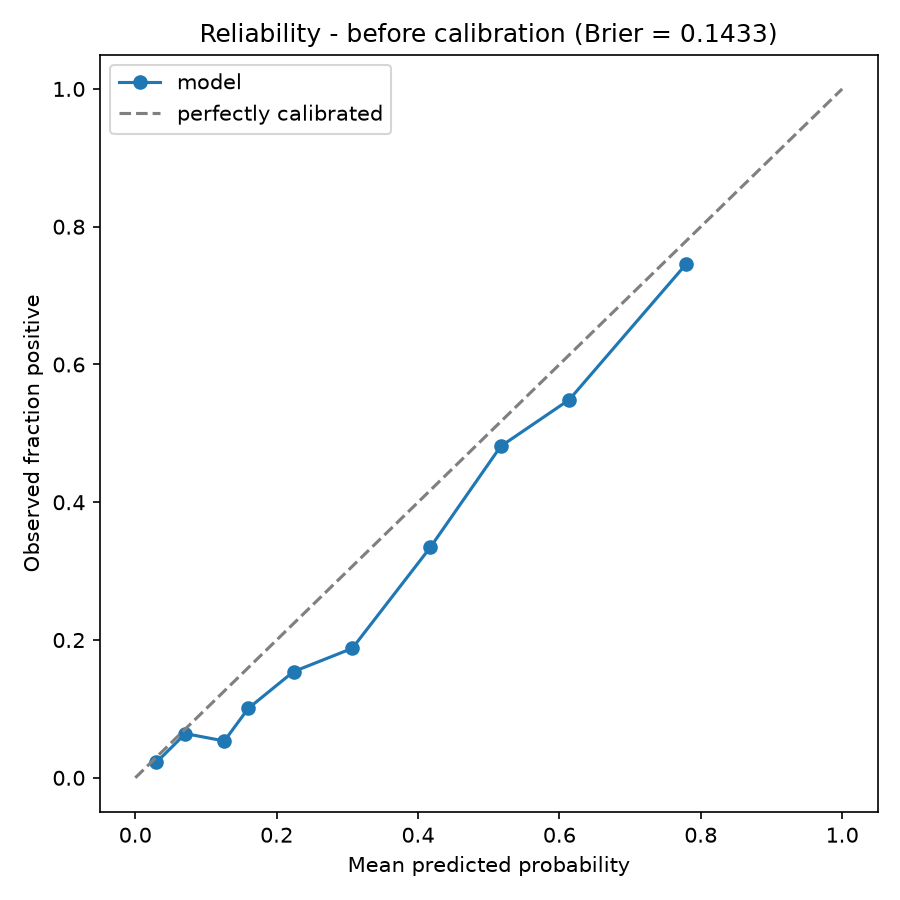
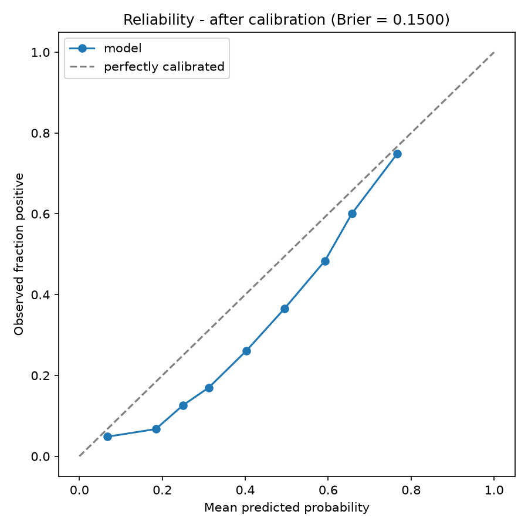

# 🚀 AI-Powered Startup Success Predictor & Advisor

*Data-driven insights and Generative AI to evaluate, predict, and scale the next big unicorn.*

[](https://startup-success-predictor-d5u63hesntzh5ayhsm64ds.streamlit.app/) 
[](#)
[](#)

---

##  The Problem Statement
Over **90% of startups fail** within their first few years. Founders often lack data-backed validation for their ideas and struggle to find actionable, contextual advice during critical phases like fundraising and MVP building. 

**The Solution:** This project bridges the gap between raw statistical data and strategic execution. It provides founders with a realistic success probability based on historical metrics and pairs it with an intelligent AI consultant to guide their next steps.

## 🌟 Key Features

1. **📈 Real-Time Predictive Engine**: 
   - Evaluates startups using a `HistGradientBoostingClassifier` trained on ~13k real, labeled Crunchbase companies (see `DATA_CARD.md`, `MODEL_CARD.md`).
   - Considers funding trajectory (amount, rounds, timing), founding date, country, region, and category.
   - Displays a **calibrated** probability, a real empirical percentile against the training cohort, and SHAP-based reasons for the prediction.
2. **🤖 Context-Aware AI Advisor**: 
   - Integrated with **Google Gemini 2.0 Flash** for high-speed, strategic business consulting.
   - Features a custom, highly responsive ChatGPT-style chat interface with built-in fallback mechanisms for high availability.
3. **📊 Interactive Analytics Dashboard**: 
   - Plotly-powered visual insights into market trends, funding vs. success correlations, and industry risk analysis.
4. **⚡ Headless API Architecture**: 
   - Includes a standalone FastAPI backend, allowing the prediction model to be consumed programmatically by mobile apps or other web services.

## 💎 What Makes This Project Unique?
Unlike standard ML projects that stop at a binary "Pass/Fail" prediction, this application combines **Predictive AI** (Scikit-Learn) with **Generative AI** (Google Gemini). It doesn't just tell founders *if* they will succeed—it tells them *why* and advises them on *how* to improve their odds. It is built with a product-first mindset, featuring custom UI/UX and robust error handling.

## ⚙️ How It Works (System Flow)
1. **Data Ingestion:** User inputs core startup metrics via the Streamlit UI or REST API.
2. **ML Inference:** The system loads a pre-trained, calibrated `HistGradientBoostingClassifier` (`models/production/hist_gradient_boosting_full_calibrated.joblib`) to calculate a calibrated success probability, a SHAP-based explanation, and a real percentile.
3. **Generative Consultation:** Users interact with the Gemini-powered AI advisor to discuss roadblocks, fundraising strategies, and product-market fit.
4. **Visualization:** The analytics engine processes the data and generates real-time performance graphs and industry comparisons.

## 🛠️ Tech Stack & Architecture

- **Frontend:** Streamlit, Custom HTML/CSS, Plotly
- **Backend & API:** FastAPI, Uvicorn, Python
- **Machine Learning:** Scikit-Learn, Pandas, NumPy, Joblib
- **Generative AI:** Google GenAI SDK (Gemini 2.0 Flash)

## 🧠 Model Details & Performance
- **Algorithm:** `HistGradientBoostingClassifier`, trained on real Crunchbase data (`DATA_CARD.md`) with a time-based train/test split.
- **Input Features:** `founded_year`, `time_to_first_funding_days`, `funding_total_usd_log1p`, `funding_rounds`, `funding_span_days`, `country_code`, `region`, `primary_category`.
- **Measured performance, clean-vs-full leakage comparison, and CV-vs-holdout discussion:** see `MODEL_CARD.md`.
- **Current limitations:** never trained on unresolved (`operating`) companies, inherits Crunchbase's survivorship bias, and the full feature set includes funding fields only known after a company's outcome — see `MODEL_CARD.md`'s "what this model cannot do."

## 🎯 Calibration & Explainability

A `HistGradientBoostingClassifier`'s raw `predict_proba` isn't automatically a calibrated probability — a displayed "73%" should mean "roughly 73 of 100 startups scoring this way actually succeeded," not just "this one ranked highly." `src/models/calibrate.py` fits a fresh base model on a `train_fit` split, then fits `CalibratedClassifierCV` (method chosen automatically: **isotonic**, since the held-out calibration split had 2,135 rows) on a disjoint `calibration` split that neither the base model nor the test cohort ever saw, and evaluates both the raw and calibrated model once on the untouched test cohort.

| | Brier score (test cohort, lower is better) |
|---|---|
| Before calibration | **0.1433** |
| After calibration | **0.1500** |




**Honest finding:** calibration did not improve, and slightly worsened, the Brier score here. `HistGradientBoostingClassifier` is trained with log-loss and tends to already be reasonably calibrated out of the box; fitting an unconstrained isotonic step function on a ~2k-row calibration split can add variance without a clear net benefit. Both reliability diagrams are shown above rather than only the flattering one.

The app's "Why this result?" section is powered by a cached `shap.TreeExplainer` (`src/models/explain.py`) over the base (pre-calibration) tree model, showing the top signed feature contributions for that specific prediction. The "Industry Comparison" percentile is a real empirical percentile (`src/models/percentile.py`) against the calibrated score distribution of the training cohort — not the raw probability relabeled, which is what the app showed before this change.

## 📸 Demo

*(Add screenshots of your UI here)*

> **[Live Streamlit App: Startup Success Predictor](https://startup-success-predictor-d5u63hesntzh5ayhsm64ds.streamlit.app/)**

## ⚙️ Installation & Setup

### 1. Clone the repository
```bash
git clone https://github.com/avnish1505/Predicting-startup-success-using-AI.git
cd "Predicting-startup-success-using-AI"
```

### 2. Install Dependencies
It is recommended to use a virtual environment.
```bash
pip install -r requirements.txt          # production runtime only
pip install -r requirements-dev.txt      # + testing/linting/training/notebook tools
```

### 3. Setup API Keys
Create a `.streamlit/secrets.toml` file in the root directory and add your Google Gemini API key:
```toml
GEMINI_API_KEY = "your_actual_api_key_here"
```

### 4. Build the data and model pipeline
Requires a Kaggle account and API credentials (`~/.kaggle/kaggle.json` or `KAGGLE_USERNAME`/`KAGGLE_KEY`) for the first step only - `models/production/` is already committed, so this step is only needed if you want to rebuild the pipeline from scratch:
```bash
python -m src.data.build       # downloads the real Crunchbase dataset, writes data/processed/
python -m src.models.train     # trains and compares dummy/logreg/HGB baselines, writes models/ and reports/
python -m src.models.calibrate # calibrates the production model, writes models/production/
```

### 5. Run the Application
Start the Streamlit web application:
```bash
streamlit run app.py
```

*(Optional)* To run the FastAPI backend:
```bash
uvicorn api:app --reload
```

## 📁 Project Structure

- `app.py`: Main Streamlit application, wired to `models/production/` (calibration + SHAP + percentile).
- `src/data/`: `schema.py` (column/label/leakage constants), `download.py` (Kaggle fetch), `build.py` (labeling, leakage-aware feature engineering, time-based split).
- `src/models/`: `train.py` (dummy/logreg/HGB baselines), `evaluate.py` (metrics/threshold/calibration helpers), `calibrate.py` (leak-free `CalibratedClassifierCV`), `explain.py` (cached SHAP explainer), `percentile.py` (empirical CDF).
- `DATA_CARD.md` / `MODEL_CARD.md`: real measured numbers, leakage findings, and limitations.
- `api.py`: production FastAPI backend on the calibrated pipeline (Pydantic validation, lifespan-loaded model/explainer/ECDF, `/predict`, `/predict/batch`, `/health`, `/model-info`). See `tests/test_api.py`.
- `predictor.py` / `startup_model.pkl`: legacy 4-feature toy model, no longer used by either `app.py` or `api.py` as of this version - kept only as an artifact of the project's earlier state.
- `advisor_ai.py`: Gemini AI integration with fallback mechanisms.
- `analytics.py`: Data visualization and dashboard metrics.
- `requirements.txt`: Python dependencies.

## 🚀 Future Scope

- Hyperparameter-tune `HistGradientBoostingClassifier` (Step 2 baselines were intentionally untuned).
- Add authentication/login for personalized user dashboards.
- Validate the Dockerfile with an actual `docker build`/`docker run` (this session's environment had no running Docker daemon to test against).

---
*Built with ❤️ by [Avnish Singh](https://github.com/avnish1505)*